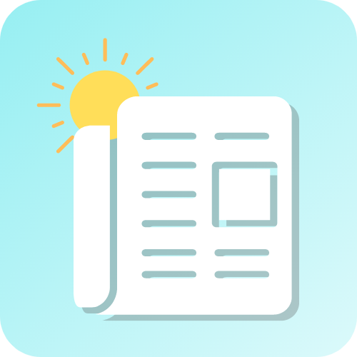
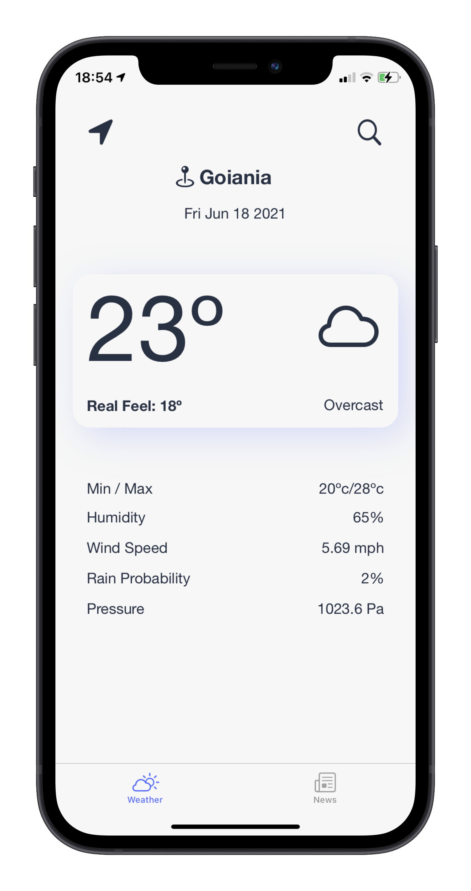
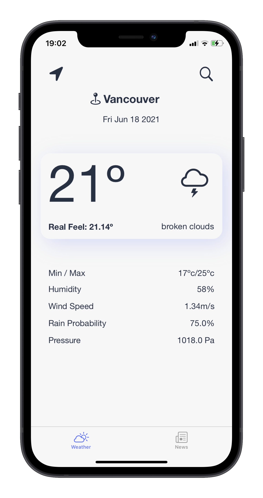
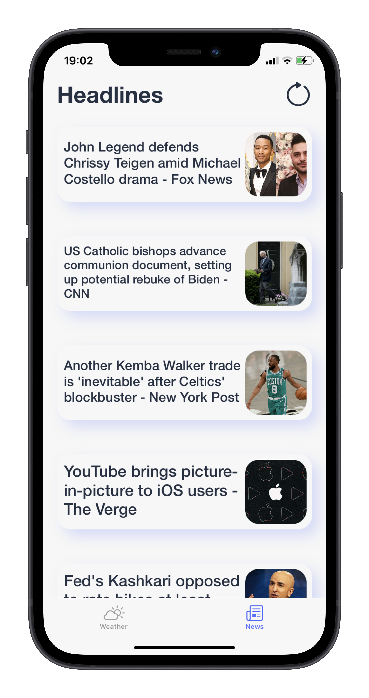
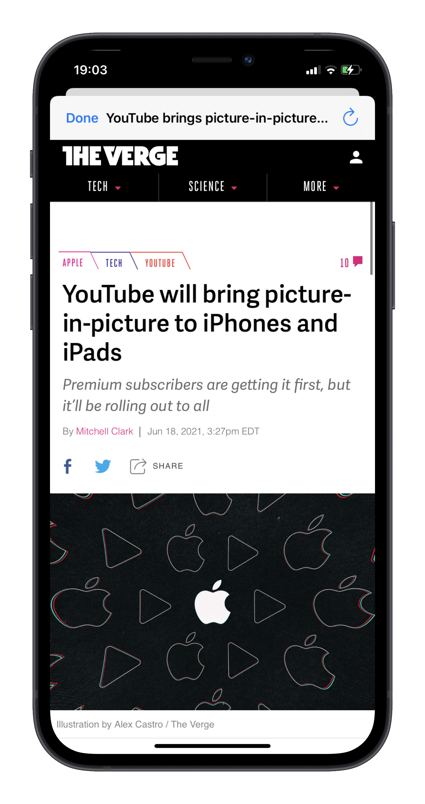
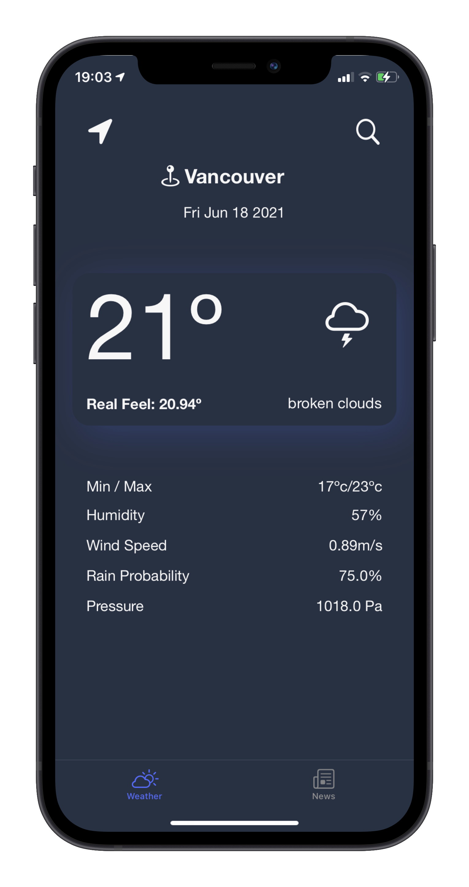
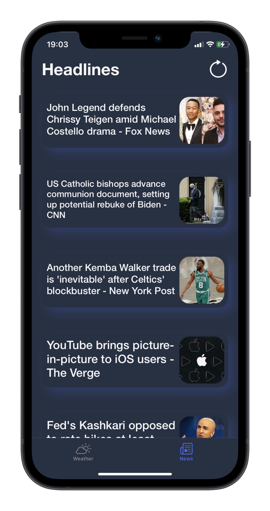

  
  <h1 align="center">DailyJournal</h1>
  <h3 align="center">A app that brings to your phone those morning newspapers you just take a glance to know how's everything</h3>
  

    
    
    
    
    
    
  

<h3>How was the creation process for me ? </h3>

 Personally the main reason for this project was for me to really understand how APIs works, and in the end, I think I got a pretty good deal of how they work, and to make a better use of that knowledge, I decided to create a minimalist newsPaper/ Weather app with a great UI so the user can easily access and know by the morning how the weather is and what the daily headline is :sunglasses: 

## Skills
- Swift 5 :bird:
- [OpenWeather API](https://openweathermap.org/api), and [News API](https://newsapi.org/)
- WebKit :iphone:
- CoreLocation :earth_americas:
- MVC Design Pattern :books:
- Auto-Layout :triangular_ruler:

## Building Process
1. First I draw how I wanted the app to look like, and also got some ideas from the internet
2. After that it was time to code... and because this project it's actually not that difficult, I started by making the Location and Weather Data, Model, and Manager so I could get all the information I wanted from the APIs to my app;
3. Then it was time to create the UI, and as I said, I went for more like a minimalist desing on the app, with the first screen beeing composed with a big reounded rectanlge with the main information about the weather, below that some more information about it, on top you got the magnifying glass button on which you click and write the name of the place you want to know the weather, and when you want to go back to your location you click on the arrow button;
4. For the arrow button, of which when clicked it get's your location and display how it is, for me it was a bit difficult because I had to use CoreLocation, nad I'd never used it before, but after you get the hang of it, it was alright;
5. Then to the second page, of which would be for the NewsAPI, I create a TableView with custom cell, of which would get the data from the API and display on the cells, and when the user clicks on a cell, it opens with the help of WebKit a safari page with the selected news from the app;

## Overall
It was a great learning expirence I'm sure, really learning how to fetch and display data from the API on the app, understanding a bit more about UI design and minimalist designs, and also learning about new frameworks as WebKit and CoreLocation 😁
